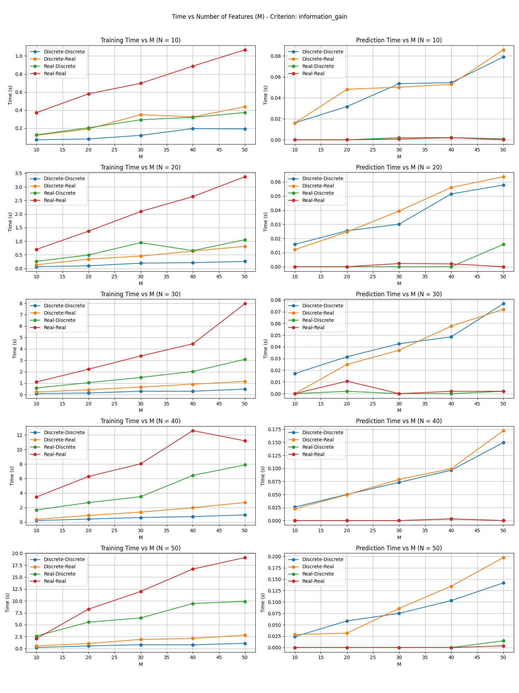
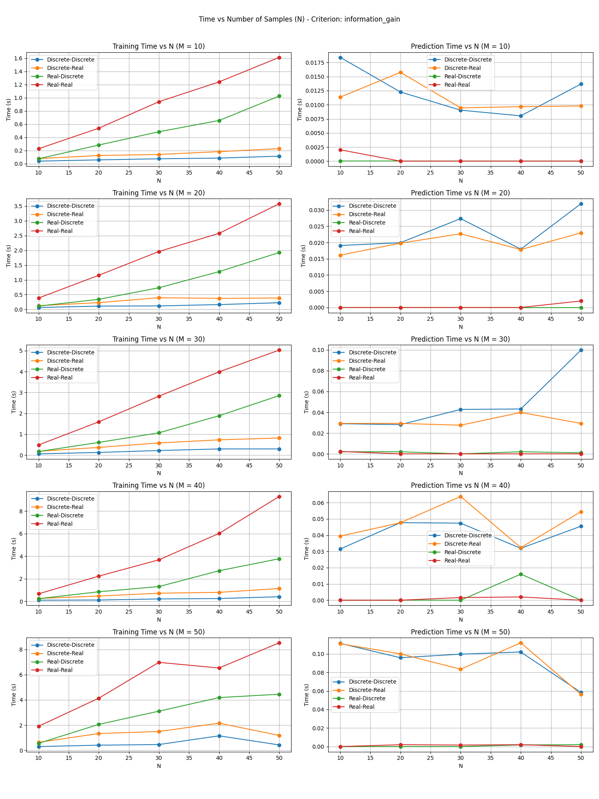

**Complexity:** Training ≈ **O(M·N log N)** average (up to **O(M·N²)** worst); Prediction for **T** test samples ≈ **O(T log N)** average (up to **O(T·N)** worst).
Here, **N = number of training samples**, **M = number of features**, and **T = number of test samples**.

